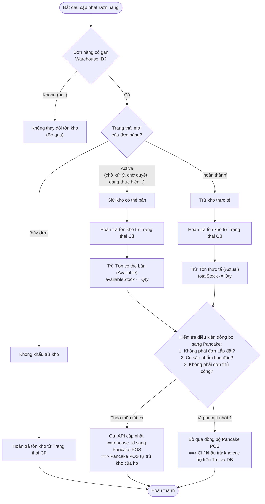
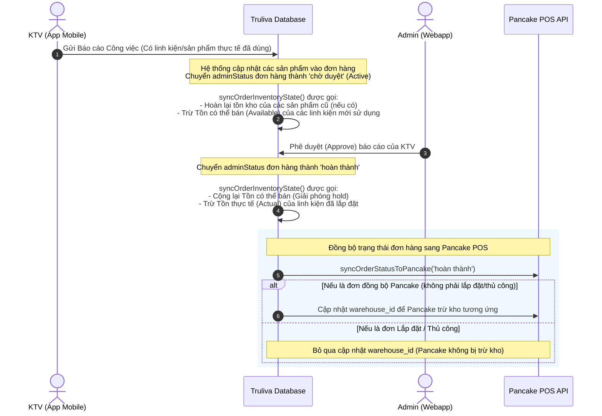

# Tài liệu Luồng Khấu trừ Hàng tồn kho - Hệ thống Truliva

Tài liệu này trình bày chi tiết luồng xử lý và các quy tắc nghiệp vụ liên quan đến việc trừ kho hoặc hoàn kho của sản phẩm tại hệ thống **Truliva Webapp**, bao gồm cả cơ chế đồng bộ với **Pancake POS** và điều chỉnh kho cục bộ (Local DB).

---

## 1. Tổng quan cấu trúc quản lý kho

Hệ thống Truliva quản lý hàng tồn kho song song ở hai cấp độ:

1. **Kho trên Pancake POS (External)**:
   - Quản lý thực tế trên hệ thống Pancake POS. Khi đơn hàng có chỉ định kho xuất (`warehouse_id`) và được đồng bộ lên Pancake, Pancake POS sẽ tự động xử lý tăng/giảm tồn kho của họ.
2. **Kho cục bộ Truliva (Internal DB)**:
   - Lưu trữ trong cơ sở dữ liệu Truliva (Bảng `Product`, cụ thể là thuộc tính `variations_warehouses` trong trường `rawData`).
   - Tồn kho cục bộ được chia làm 2 loại chỉ số:
     - **Tồn có thể bán (Available Stock - `remain_quantity`)**: Tồn kho thực tế trừ đi lượng hàng đang bị giữ (hold) bởi các đơn hàng đang xử lý.
     - **Tồn thực tế (Actual Stock - `actual_remain_quantity`)**: Số lượng sản phẩm vật lý thực tế đang nằm trong kho.

---

## 2. Phân loại Trạng thái Đơn hàng & Tác động Kho cục bộ

Hàm xử lý tồn kho chính của hệ thống là `syncOrderInventoryState` (nằm trong `src/services/inventoryService.ts`). Cơ chế hoạt động dựa trên trạng thái quản trị của đơn hàng (`adminStatus`):

### A. Phân nhóm trạng thái đơn hàng:
*   **Trạng thái Hoạt động (Active Statuses - Giữ hàng)**:
    - Bao gồm: `'chờ xử lý'`, `'chờ duyệt'`, `'đang thực hiện'`, `'đang hoàn'`, `'đã hoàn'`, `'đang đổi'`, `'đã đổi'`, `'hoàn một phần'`.
    - *Bất kỳ trạng thái nào KHÔNG phải là `'hoàn thành'` và `'hủy đơn'` đều được coi là Active.*
*   **Trạng thái Hoàn thành (Completed Status - Trừ kho thực tế)**:
    - Chỉ bao gồm: `'hoàn thành'`.
*   **Trạng thái Hủy (Cancelled Status - Không tác động kho)**:
    - Chỉ bao gồm: `'hủy đơn'`.

### B. Quy tắc Điều chỉnh Tồn kho cục bộ:
Khi một đơn hàng thay đổi trạng thái từ **Trạng thái Cũ** sang **Trạng thái Mới**, hệ thống sẽ thực hiện theo 2 bước liên tiếp:

#### Bước 1: Đảo ngược ảnh hưởng của trạng thái cũ (Revert Old State)
*   Nếu trạng thái cũ là **Active** và đơn hàng có kho (`warehouseId`): Hoàn trả lại số lượng sản phẩm vào **Tồn có thể bán** (`availableStock += quantity`).
*   Nếu trạng thái cũ là **Completed** và đơn hàng có kho (`warehouseId`): Hoàn trả lại số lượng sản phẩm vào **Tồn thực tế** (`totalStock += quantity`).
*   Nếu trạng thái cũ là **Cancelled** (hoặc đơn mới tạo không có trạng thái cũ): Không cần hoàn trả gì.

#### Bước 2: Áp dụng ảnh hưởng của trạng thái mới (Apply New State)
*   Nếu trạng thái mới là **Active** và đơn hàng có kho (`warehouseId`): Khấu trừ sản phẩm khỏi **Tồn có thể bán** để giữ hàng (`availableStock -= quantity`).
*   Nếu trạng thái mới là **Completed** và đơn hàng có kho (`warehouseId`): Khấu trừ sản phẩm khỏi **Tồn thực tế** (`totalStock -= quantity`).
*   Nếu trạng thái mới là **Cancelled** (hoặc không gán kho): Không thực hiện khấu trừ.

---

## 3. Luồng Đồng bộ Kho sang Pancake POS (`shouldSyncWarehouseToPancake`)

Khi người dùng (Admin/Điều phối) thay đổi Kho xuất hàng (`warehouseId`) của đơn hàng trên Truliva Webapp, hệ thống cần gửi yêu cầu cập nhật `warehouse_id` sang Pancake POS để Pancake POS tự khấu trừ kho bên phía họ.

Tuy nhiên, **việc đồng bộ này bị BỎ QUA (Bypassed - Không trừ kho trên Pancake POS)** trong các trường hợp sau:

1.  **Đơn hàng Lắp đặt**: Đơn hàng có loại công việc (`workType`) là `'Lắp đặt'`.
2.  **Đơn hàng không có sản phẩm ban đầu**: Đơn hàng đồng bộ từ Pancake POS về nhưng ban đầu không chứa bất kỳ mặt hàng nào.
3.  **Đơn hàng thủ công**: Các đơn hàng được Admin tạo trực tiếp trên Truliva Webapp (có `pancakeOrderId < 0`).

> [!IMPORTANT]
> Đối với 3 trường hợp trên:
> *   Hệ thống **KHÔNG** cập nhật thông tin kho sang Pancake POS (Pancake POS không trừ kho).
> *   Nhưng hệ thống **VẪN** khấu trừ tồn kho cục bộ trên Truliva DB bình thường theo quy tắc ở **Mục 2**.

---

## 4. Sơ đồ Luồng Quyết định (Decision Flowchart)

Dưới đây là sơ đồ chi tiết về luồng xử lý tồn kho khi có sự thay đổi đơn hàng (Tạo đơn / Cập nhật đơn / Webhook Pancake):

---

## 5. Luồng Nghiệp vụ Kỹ thuật viên (KTV) nộp báo cáo

Khi KTV đi lắp đặt/sửa chữa và gửi báo cáo thông qua Mobile App, luồng thay đổi kho diễn ra như sau:

---

## 6. Cơ chế Tự Phục hồi & Đồng bộ Ngược (Sync Back)

Để tránh lệch tồn kho giữa Pancake POS và Truliva DB, hệ thống hỗ trợ 2 cơ chế cập nhật ngược:

1.  **Webhook thời gian thực (`variations_warehouses`)**:
    - Khi có bất kỳ thay đổi tồn kho nào trên Pancake POS, Pancake sẽ gửi webhook `variations_warehouses` đến Truliva.
    - Hệ thống Truliva sẽ ngay lập tức cập nhật lại số lượng tồn kho mới nhất của sản phẩm đó trong Database cục bộ.
    - Đồng thời, hệ thống tự động gọi API Pancake lấy thông tin đơn hàng tương ứng để đồng bộ ngược lại trạng thái đơn hàng nếu có trễ webhook.
2.  **Đồng bộ thủ công (Manual Sync)**:
    - Admin có thể nhấn nút **Đồng bộ sản phẩm** trên giao diện Webapp (gọi tới endpoint [POST] `/api/inventory/sync`).
    - Hệ thống sẽ gọi API Pancake POS quét toàn bộ sản phẩm và ghi đè số lượng tồn kho thực tế sang cơ sở dữ liệu Truliva.
